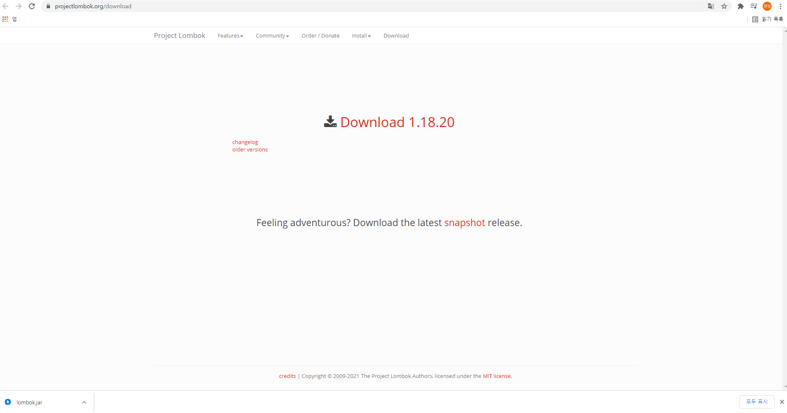

# Chap1-4 ~ 6 Project 만들기

### :one: Spring Boot project 생성

- JAVA 버전은 8이 깔려있어서 8로 사용했음.
- 추가한 의존성
  - Spring Web
  - Spring Data JPA
  - Spring HATEOAS
  - Spring REST Docs
  - H2 Database
    - 인메모리를 사용할 수 있는 DB 의존성
    - scope을 test로 했을 때 애플리케이션 실행 시에 사용되지 않음
    - 대신 postgresql이 실행 됨.
    - scope이 test가 아니고 postgresql 둘 두 있을 경우 test에 어떤 설정도 없다면 h2가 실행 된다.
  - PostgreSQL Driver
    - 인메모리가 아닌 DB 의존성
  - Lombok
    - Lombok 사용시 다운 받고 설정 필요
    - 설정법
- @EnableAutoConfiguration : 자동 설정


#### :diamond_shape_with_a_dot_inside: Lombok 설치 및 설정 :diamond_shape_with_a_dot_inside:

1. 설치

   

   - 위 사이트에서 lombok.jar 파일 설치

2. STS.exe 위치에 lombok.jar 파일 옮기기

   

3. lombok.jar 실행

   - jar 파일을 압축 파일로 인식해 .zip 처럼 열린다면 아래와 같이 실행한다.

     1. JDK 혹은 zulu 폴더에 bin 폴더 경로를 복사한다.

        

     2. cmd 창을 열어 복사한 경로로 간다.
     
     3. 아래와 같이 명령어를 입력한다.
     
        ```
        java -jar lombok.jar파일경로
        ```
     
     

4. Specify lovation... -> STS.exe 선택 -> STS 체크 -> Install / Update -> Quit Installer

   

   

   


### :two: Event 도메인 구현

- Event Class 생성

  ```java
  @Builder @AllArgsConstructor @NoArgsConstructor
  @Getter @Setter @EqualsAndHashCode(of = "id")
  public class Event {
  	
  	private Integer id;
  	private String name;
  	private String description;
  	private LocalDateTime beginEnrollmentDateTime;
  	private LocalDateTime closeEnrollmentDateTime;
  	private LocalDateTime beginEventDateTime;
  	private LocalDateTime endEventDateTime;
  	private String location; // (optional) 이게 없으면 온라인 모임
  	private int basePrice; // (optional)
  	private int maxPrice; // (optional)
  	private int limitOfEnrollment;
  	private boolean offline;
  	private boolean free;
  	private EventStatus eventStatus;
  	
  }
  ```

  - @Builder
    - 장점 : 입력하는 값이 무엇인지 알 수 있다.
    - builder는 public이 아니다보니 다른 package에서 사용할 수가 없으므로 생성자를 사용해야하지만, builder가 생성되면 기본 생성자 생성 안되므로 생성자 사용 불가
    - 그러므로, @AllArgsConstructor @NoArgsConstructor 필요
  - @AllArgsConstructor
    - 모든 인자를 담는 생성자
  - @NoArgsConstructor
    - 기본 생성자
  - @EqualsAndHashCode(of = "id")
    - 객체 간의 상호 참조하는 연관 관계라면 Equals와 HashCode를 구현한 코드 안에서 스택 오버플로우가 발생할 수 있으므로 id로만 Equals와 HashCode를 비교하도록 사용
    - 즉, Equals와 HashCode를 id만 사용하라는 의미  

- Test class 만들기

  - test/java에 Event와 같은 package로 EventTest class 생성

  - builder 유무 확인

    ```java
    @Test
    public void builder() {
        Event event = Event.builder()
    			.name("Inflearn Spring REST API")
    			.description("REST API development with Spring")
    			.build();
    	assertThat(event);
    }
    	
    ```


### :rotating_light:  오류 해결

- no tests found with test runner 'JUnit 5' 오류

  

  - JUnit 4로 테스트하는데 설정이 JUnit 5로 되어있을 때 생기는 오류

  - 해결방법
    - run configurations -> JUnit -> Test class 선택 -> Test runner 설정 -> JUnit 4로 변경

      

- 

  

